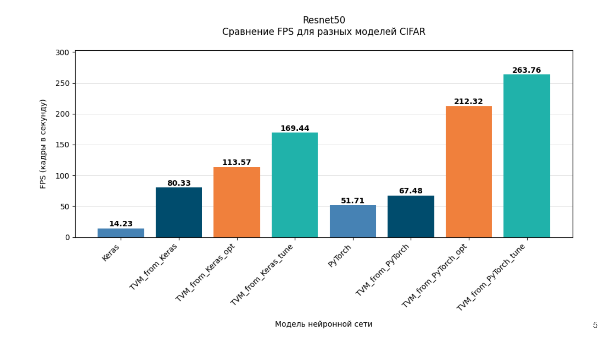
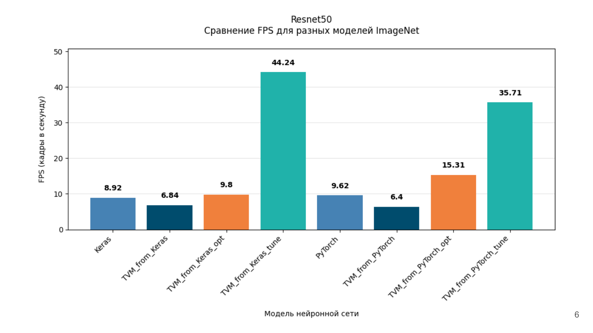
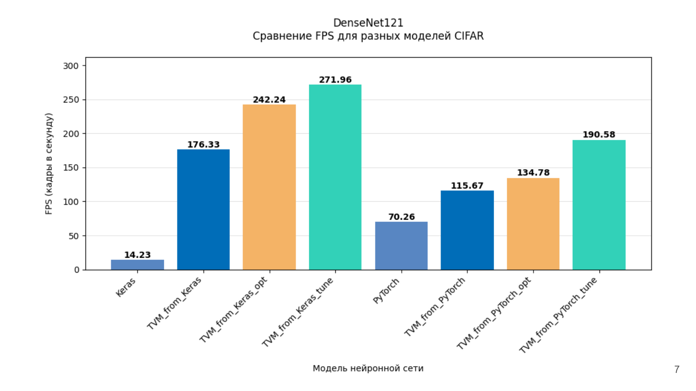
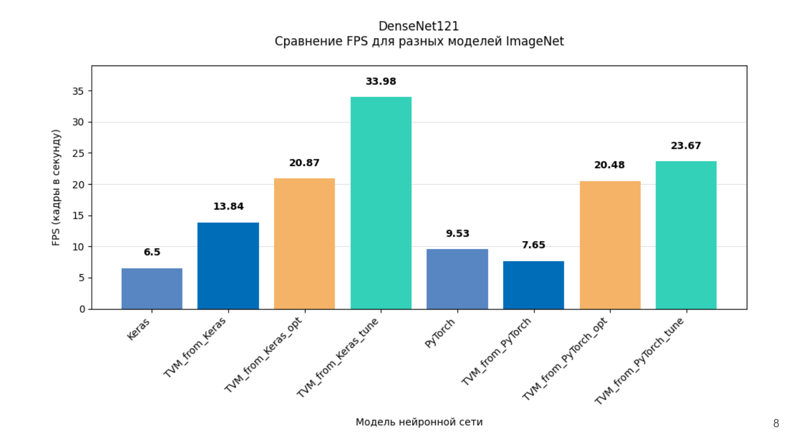
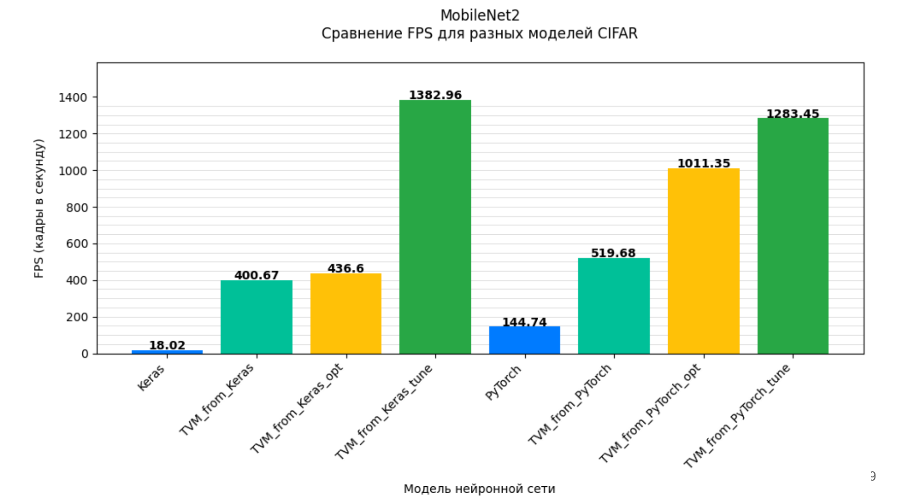
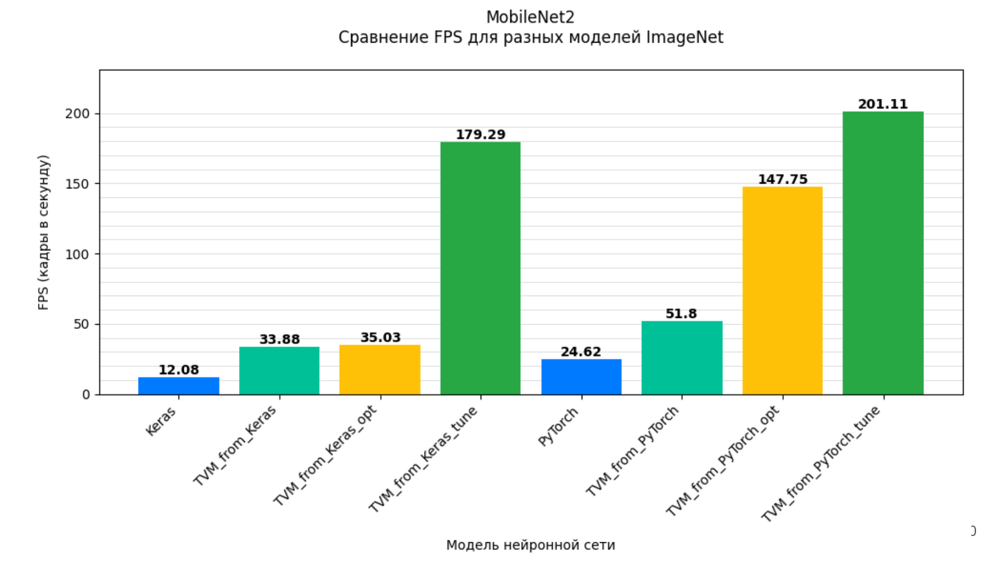

<!DOCTYPE html>
<html lang="ru">
<head>
  <meta charset="UTF-8">
</head>
<body>
  <h1>Учебный проект ItLab: Ускорение инференса нейронных сетей с помощью Apache TVM</h1>

  <h2>Описание проекта</h2>
  

    Данный проект является учебным проектом ItLab, направленным на ускорение инференса нейронных сетей с помощью Apache TVM.
    Проект включает в себя набор скриптов и Jupyter Notebook, предназначенных для оптимизации и настройки моделей с целью повышения их производительности и эффективности.
  

  <h2>Структура проекта</h2>
  <ul>
    <li>
      <strong>Optimization</strong> 
      Содержит инструменты и скрипты для оптимизации моделей: повышение вычислительной эффективности, снижение времени выполнения и улучшение использования ресурсов.
    </li>
    <li>
      <strong>Tuning</strong> 
      В этой директории расположены ноутбуки и скрипты для настройки гиперпараметров моделей, позволяющие экспериментировать с различными конфигурациями для достижения оптимальных результатов.
    </li>
  </ul>

  <h2>Предварительные требования</h2>
  <ul>
    <li>Python 3.x;</li>
    <li>Установленные библиотеки (например, <code>NumPy</code>, <code>Pandas</code>, <code>scikit-learn</code>, <code>TensorFlow/PyTorch</code> и другие, используемые в скриптах);</li>
    <li><strong>Jupyter Notebook</strong> для интерактивного анализа и настройки моделей.</li>
  </ul>

  <h2>Вычислительное оборудование</h2>
  
В экспериментах использовался процессор:

  <ul>
    <li>
      <strong>Ryzen 4600H</strong>
      <ul>
        <li>
          <strong>Performance Cores:</strong>
          <ul>
            <li>Cores: 6</li>
            <li>Threads: 12</li>
            <li>Base Frequency: 3.0 GHz</li>
            <li>Max Frequency: 4.0 GHz</li>
          </ul>
        </li>
        <li>
          <strong>Cache:</strong>
          <ul>
            <li>L1 Cache: 32 KB</li>
            <li>L2 Cache: 512 KB</li>
            <li>L3 Cache: 8 MB</li>
          </ul>
        </li>
      </ul>
    </li>
  </ul>

  <h2>Использование</h2>
  
Проект предназначен для проведения экспериментов по оптимизации и настройке моделей. Вы можете:

  <ul>
    <li>Изучить предложенные подходы к оптимизации для улучшения производительности моделей;</li>
    <li>Использовать ноутбуки из папки <strong>Tuning</strong> для подбора оптимальных параметров и сравнения результатов;</li>
 
  </ul>

  <h2>Результаты экспериментов</h2>
  
Ниже приведены результаты экспериментов, демонстрирующие работу различных моделей.

  <h3>ResNet50</h3>
  

    

      
    

    

      
    

  

  <h3>DenseNet121</h3>
  

    

      
    

    

      
    

  

  <h3>MobileNet2</h3>
  

    

      
    

    

      
    

  

</body>
</html>
